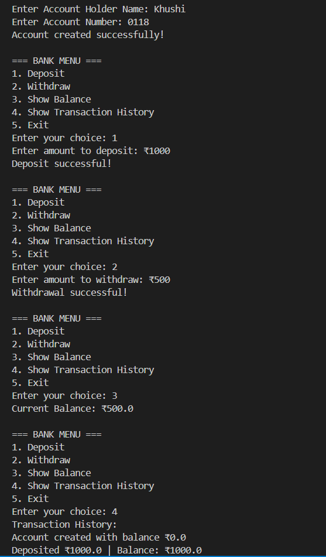

# 💳 Bank Account Simulation in Java

This project simulates basic banking operations using Object-Oriented Programming (OOP) in Java. It allows users to create a bank account, deposit and withdraw money, and view transaction history — all through a command-line interface.

---

## 🛠️ Features

- ✅ Create a new bank account  
- 💰 Deposit and withdraw money  
- 📜 View full transaction history  
- 🔐 Securely maintain account balance  
- 🧾 Simple and clean Java code using OOP principles  

---

## 📸 Output Screenshot

---

## 📂 Project Structure

BankAccountSimulation/
 ├── BankAccount.java 
 ├── Main.java
 ├── Output.png
 └── README.md 

---

## 🧑‍💻 Technologies Used

- **Language:** Java  
- **Editor:** Visual Studio Code  
- **Execution:** Terminal / Command Line  
- **Concepts:** Classes, Methods, ArrayList, Scanner, Encapsulation

---

## 🚀 How to Run

1. **Clone the repository:**
   git clone https://github.com/khushbumaurya26/BankAccountSimulation.git
   cd BankAccountSimulation
   
Compile the Java files:
javac BankAccount.java Main.java

Run the program:
java Main

📖 Sample Usage

Enter Account Holder Name: Khushi
Enter Account Number: 0118
Account created successfully!

=== BANK MENU ===
1. Deposit
2. Withdraw
3. Show Balance
4. Show Transaction History
5. Exit

   
📚 Concepts Practiced
Java Object-Oriented Programming (OOP)

Input handling using Scanner

ArrayList usage for dynamic data

Control flow using switch-case and loops

Basic simulation of banking logic

📃 License
This project is open-source and available under the MIT License.

✨ Author
Made with ❤️ by [khushbumaurya26](https://github.com/khushbumaurya26)
